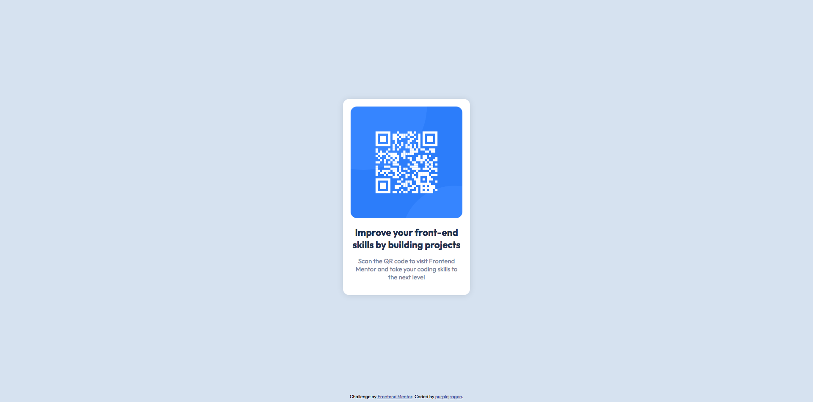

# Frontend Mentor - QR code component solution

This is a solution to the [QR code component challenge on Frontend Mentor](https://www.frontendmentor.io/challenges/qr-code-component-iux_sIO_H). Frontend Mentor challenges help you improve your coding skills by building realistic projects. 

## Table of contents

- [Overview](#overview)
  - [Screenshot](#screenshot)
  - [Links](#links)
- [My process](#my-process)
  - [Built with](#built-with)
  - [What I learned](#what-i-learned)
  - [Continued development](#continued-development)
  - [Useful resources](#useful-resources)
- [Author](#author)

## Overview

### Screenshot



### Links

- Solution URL: [Add solution URL here](https://your-solution-url.com)
- Live Site URL: [Add live site URL here](https://your-live-site-url.com)

## My process

### Built with

- HTML5 markup
- CSS styling
- Flexbox

### What I learned

I learned that I can wrap flexbox containers in other flexbox containers to make really nice alignment.
```html
<div class="container-container">
  <div class="container">
    ...
```
```css
.container-container {
  display: flex;
  flex-flow: column;
  width: 100vw;
  height: 100vh;
}
.container {
  display: flex;
  align-items: center;
  justify-content: center;
  flex-flow: column;

  background-color: var(--light-gray);
  width: 100%;
  height: 100%;
}
```

### Continued development

I want to try to use a Javascript framework for my next big project so it's easier to manage.

### Useful resources

- [A Complete Guide to Flexbox](https://css-tricks.com/snippets/css/a-guide-to-flexbox) - This helped me with aligning things properly using flexbox.

## Author

- Github - [purplejragon](https://github.com/purplejragon)
